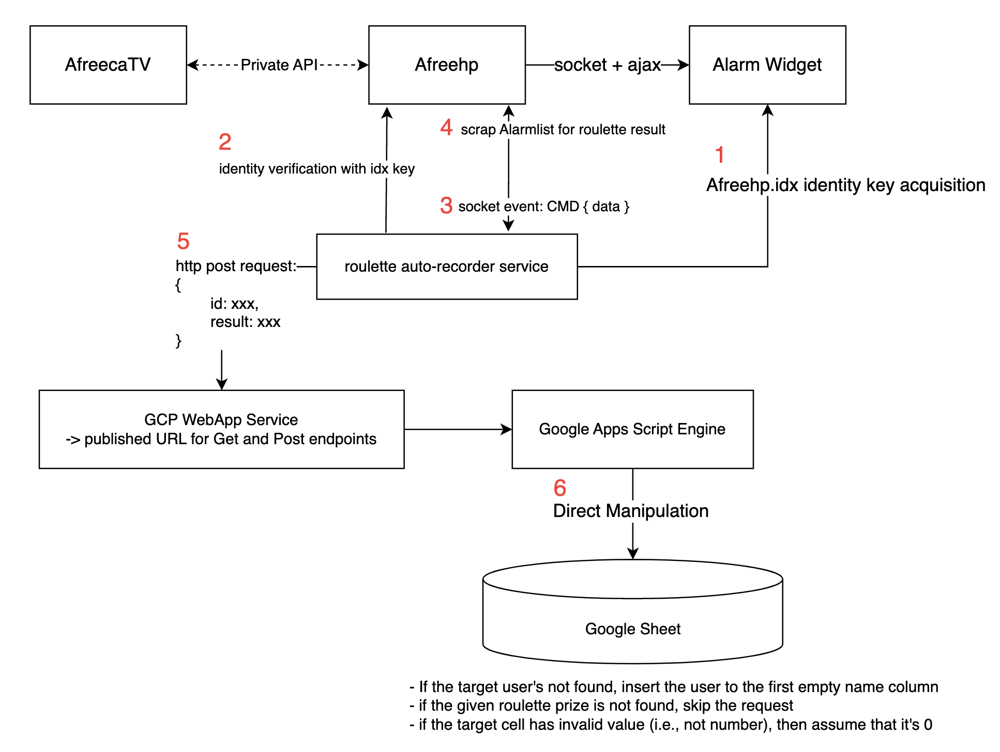

# roulette-recorder



# Project TODO
- Well, this is just an overnight toy project. No roadmap/timeline ATM.
- Other than FreecShot reimplementation (#1), most of the TODOs are for initial setup automation or usability improvements.

1. [P00] Implement Afreehp's alarmlist crawling approach instead of packet parsing
2. [P0] Someone may takeover the project to transplant the data crawling part into FreecShot platform
    1. AfreecaTV FreecShot: https://bj.afreecatv.com/afstudio/posts/50746022
3. [P0] reorganize packet data types -- currently the roulette is determined by the value (33). It should use the packet's type and subpage

4. [P0.5 for compatibility] Build binary + add Homebrew formular so that anyone can download the cmd; https://docs.brew.sh/Adding-Software-to-Homebrew

5. [P1] Re-publish the google sheet’s App Script into a stand-alone library, so that it can be re-used by simple import
6. [P1] Provide a template for rewards mappings and the records sheets, so that the script library can be used without additional modification, as long as the contents complies to the templates
    


# Required Specs
1. Automatic roulette detection with the following data extraction:
    1. donator ID
    2. draw result
2. the roulette crawler provides a webhook to a published URL for Google sheet handler
    1. only the auth’d user should update the sheet
    2. expected request schema:
    
    ```go
    struct Request {
      1: required string DonorId;
      2: required string Result;
    }
    ```
    
3. Google sheet must have a published URL for the handler, and only to increase the counter variables under the matching result columns of the given donor
    1. Single interface to take the request defined above

# Demo
```
⚠️ Currently, the project usability is specifically targeted to the following doc
업보:
- https://docs.google.com/spreadsheets/d/130R8upqQTaU3kbXOP6ny0qNWk0jOOezZfpw0Liy2sGg/edit?usp=sharing
```    

---
```
🚧 Below’s just a dev note. no need to read if you’re not going to takeover the project.
```

# **Feasibility Assessment**

## Current Limitations

- The author’s unable to develop FreecShot extension, as he’s not in S.Korea.
    - AfreecaTV requires a dev registration with Korean phone number……
    - OBS extension isn’t an option since the streamer doesn’t use it anymore + roulette is an unique feature to FreecShot
- AfreecaTV does not provide any public API for donation-related data
    - https://developers.afreecatv.com/?szWork=openapi
    - Business/Service affiliation must be done prior to the API key acquisition
        - Phone number required - non-Korean personnel cannot use the API whatsoever
        - All contents related API association found in  are private API exclusively exposed to their service with separate SA verification logics
- No balloon webhook’s provided accordingly by the CP

## Approach

### Option 1 - Monitoring Afreehp alarmlist - selected
- Afreehp provides an alarm history with capability to sort out the list based on the alarm category, such as donation, roulette, follow and etc.
- While the alarm list provides timestamp along with the names and roulette result, all the required information can be acquired by crawling the refreshed alarm page.

- Instead of naive HTML crawling with Selenium, the service may still listen to the socket packets to (sort of) simulate donation notification, then requests the alarm page HTML to parse the data. With that, the service can simply send the post request to Google sheet webapp to update the records.

### Option 2 - Afreehp Packet Parsing - preferred - won't work

!!! won't do, since the roulette computation is done by client side, and the packet from Afreehp does not include any roulette result data.

- Afreehp, a third-party utility, provides a URL-based alert configuration geared towards broadcasting support programs such as OBS, Xsplit, and FreecShot etcetc
- the auto-recording service may be able to connect to Afreehp server to retrieve the shared packets to the widget, so that the service would be able to acquire donoation data
    - example alertbox URL: http://afreehp.kr/page/VZiXlq2ax8bYmqSVwJY

```go
// player id
// draw result elem
<p class="roulette_text text short">역팬</p>

```

### Option 3 - realtime chat crawling - won’t do?

- Current AfreecaTV platform isn’t suitable for bot-based automation due to the privacy and identity verification policy
- Still, this approach may not be able to handle unexpected problems in the Chromium or the streaming platform
    - There’s some cases where the browser needs to refresh the current session in case of the stream’s disconnected
    - This can be resolved if this can be done as FreecShot extension
- Chat crawling with Selenium. Headless browser wouldn’t be a necessity though
- Basic handler can be done via Google Sheet

# Implementation Breakdown

- Data Crawler
    - Any language capable to build CLI.
        - Using Golang since my Python/JS are rusty. This part should be replaced with FreecShot extension in the longterm anyways.
- Google sheet handler + publishing
    - Thank goodness, google script has nothing to do with Visual Basics lmao

Google App Script refs

https://developers.google.com/apps-script/reference/spreadsheet

[Custom Functions in Google Sheets  |  Apps Script  |  Google for Developers](https://developers.google.com/apps-script/guides/sheets/functions)

---